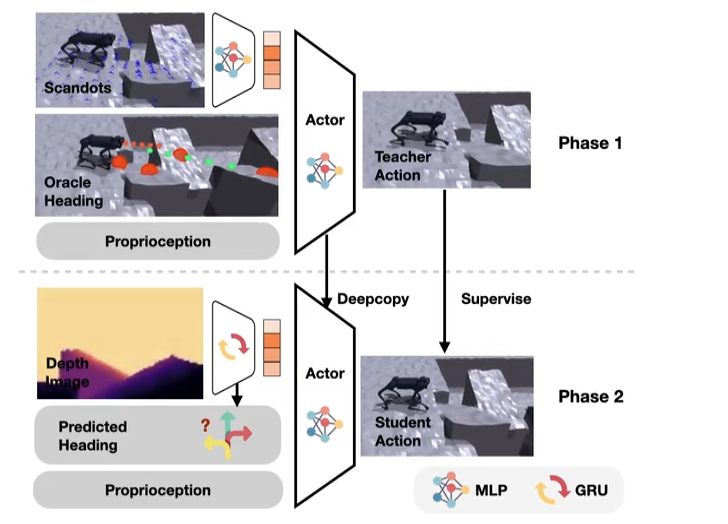

# 复现笔记



## 配置
在zuanfeng项目的docker内部安装一波环境吧
```sh
cd /workspace/isaaclab

git clone https://github.com/superboySB/Isaaclab_Parkour

cd Isaaclab_Parkour && pip3 install -e .

cd parkour_tasks && pip3 install -e .
```

## 直接看预训练结果
`assets/` 目录里已经下好了对应 checkpoint：
- `assets/pretrained_teacher/model_*.pt`
- `assets/pretrained_student/model_*.pt`

所有非训练脚本（play / evaluation / demo，以及学生模型的蒸馏验证）都支持两种方式加载权重：
- 直接加 `--use_pretrained_checkpoint`，强制使用 `assets/` 下最新的 `model_*.pt`。
- 如果已经有重新训练得到的日志，可以用 `--log_root /path/to/logs/rsl_rl/unitree_go2_parkour` 指定日志目录而不加 `--use_pretrained_checkpoint`。

Teacher 预训练结果（直接用 assets）：
```sh
python scripts/rsl_rl/play.py --task Isaac-Extreme-Parkour-Teacher-Unitree-Go2-Play-v0 --num_envs 1 --use_pretrained_checkpoint
python scripts/rsl_rl/evaluation.py --task Isaac-Extreme-Parkour-Teacher-Unitree-Go2-Eval-v0 --use_pretrained_checkpoint
python scripts/rsl_rl/demo.py --task Isaac-Extreme-Parkour-Teacher-Unitree-Go2-Play-v0 --use_pretrained_checkpoint
```

Student（蒸馏）预训练结果（直接用 assets）：
```sh
python scripts/rsl_rl/play.py --task Isaac-Extreme-Parkour-Student-Unitree-Go2-Play-v0 --num_envs 1 --use_pretrained_checkpoint
python scripts/rsl_rl/evaluation.py --task Isaac-Extreme-Parkour-Student-Unitree-Go2-Eval-v0 --use_pretrained_checkpoint
python scripts/rsl_rl/demo.py --task Isaac-Extreme-Parkour-Student-Unitree-Go2-Play-v0 --use_pretrained_checkpoint
```

其中，play就是可视化，evaluation就是多次测试输出metrics，而demo基于`play`的加载逻辑，却额外创建相机、手柄控制、第三人称视角等交互能力，适合手动控制。要切换到自己训练得到的日志，只需要把 `--use_pretrained_checkpoint` 替换成
`--log_root /workspace/isaaclab/Isaaclab_Parkour/logs/rsl_rl/unitree_go2_parkour`（或其他日志路径），脚本会从该目录里自动挑最新 checkpoint。

上面这些命令会保持现有场景/训练参数不变，只是载入指定 checkpoint，运行后也会在相应日志目录下自动导出 JIT/ONNX（play.py 内置的导出逻辑）。

## 重新训练两阶段
```sh
python scripts/rsl_rl/train.py --task Isaac-Extreme-Parkour-Teacher-Unitree-Go2-v0 --seed 1 --headless
python scripts/rsl_rl/train.py --task Isaac-Extreme-Parkour-Student-Unitree-Go2-v0 --seed 1 --headless
```

## Tips
### 相机控制按键
```
press 1 or 2: Going to environment

press 8: camera forward    

press 4: camera leftward   

press 6: camera rightward   

press 5: camera backward

press 0: Use free camera (can use mouse)

press 1: Not use free camera (default)
```

### 原作者的todo
一个sim2sim的pipeline，对应mujoco：
https://github.com/CAI23sbP/go2_parkour_deploy
